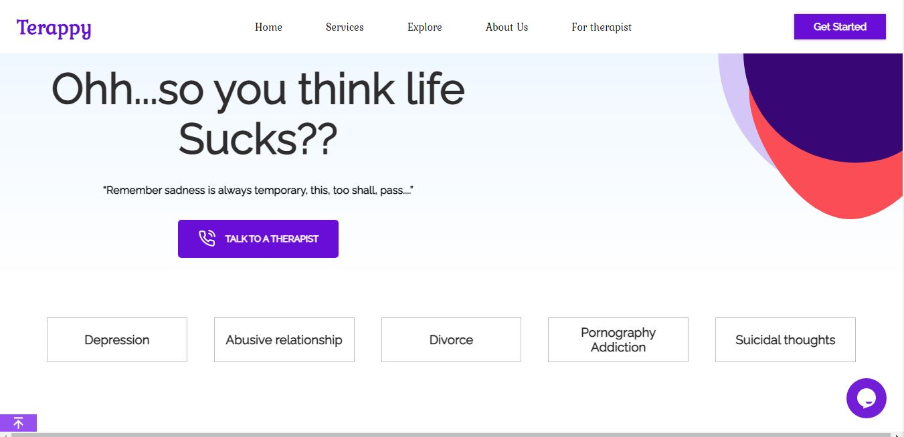

  

# Terappy

> Terappy is a a platform where individuals with mental health issues can easily find therapist and other mental health professional. The user can find and book appointments with therapists. The sole aim of this platform in to bridge the gap between society and the therapist.
 

Additional description about the project and its features.

## Services

`Addiction` `Depression` `Divorce` `Suicidal thoughts` `Relationship` `Anxiety` `Stress` 

### Features of terappy
1. A user can find and book appointments with therapist
2. A user can join clubs tailored for their needs
3. A user can access terappy market place and purchase terappy products
4. A user can join terappy gym classes as recommended by his/her therapist (if said activity will help user recover quickly to get back to normal life)
5. A user can order home grown terappy organic products in the EAT WELL ORGANIC STORE
6. A user can sign up and listen to podcasts to speed up his/her recovery process
7. A user can volunteer to join outreach programs organized by terappy
8. A user can find and meet new people on terappy MEET NEW PEOPLE platform (if said activity is required to facilitate recovery process);
9. A user can read blog on related topics to encourage him/her to continue recovery process

## Live Demo

[Visit terappy](https://terappy.netlify.app/)

## Getting Started

To get a local copy up and running follow these simple example steps.

## Founder
👤 **Amedzro Elikplim Emmanuel**

- GitHub: [@Amedzro-Elikplim](https://github.com/Amedzro-Elikplim)
- Twitter: [@ElikplimAmedzro](https://twitter.com/Amedzro-Elikplim)
- LinkedIn: [Emmanuel Elikplim Amedzro](https://www.linkedin.com/in/emmanuel-elikplim-amedzro-187590125/)

## Show your support

Give a ⭐️ if you like this project!

## 📝 License

This project is [MIT](./LICENSE) licensed.